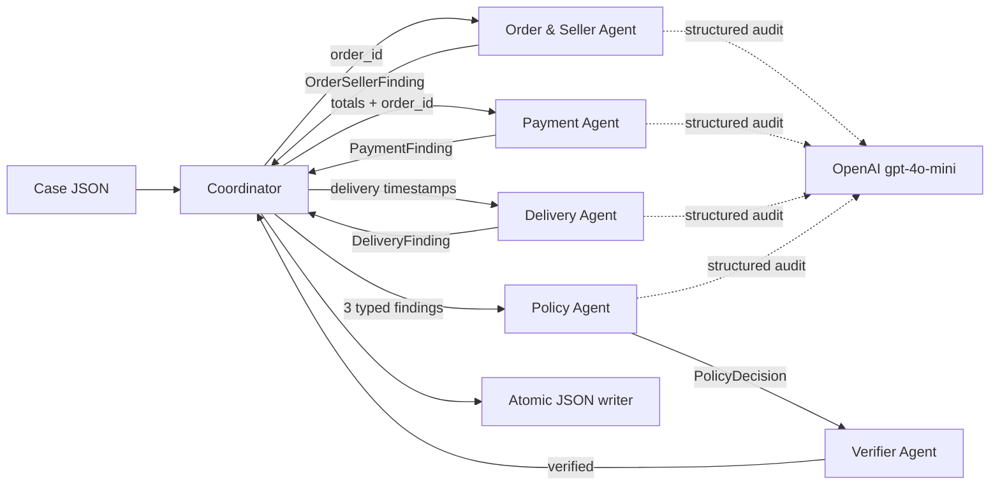

# Architecture — Multi-Agent E-commerce Dispute Resolution

## 1. Mục tiêu và nguyên tắc

Hệ thống xử lý độc lập 50 case `EC_001`–`EC_050`, ưu tiên dữ liệu CSV có thể
kiểm chứng thay vì nội dung claim. Mỗi agent có phạm vi dữ liệu, contract và
handoff riêng. LLM chỉ audit các finding đã tính; quyết định tiền, ngày, policy,
evidence và schema được code deterministic kiểm tra lại trước khi ghi output.

Model được khai báo trực tiếp trong `src/config.py` là `gpt-4o-mini` và gọi qua
OpenAI API với Structured Outputs/Pydantic. OpenAI không công bố parameter count
của model này; giảng viên đã xác nhận cho phép nhóm sử dụng `gpt-4o-mini` trong
bài lab. Metadata ghi rõ cả approval và trạng thái parameter không công bố.

## 2. Sơ đồ agent và handoff

Mỗi mũi tên được ghi thành event JSONL có `run_id`, `case_id`, actor, target và
summary. Khi `--llm-mode all`, bốn agent chuyên môn thực hiện bốn API audit riêng
cho mỗi case; không có một prompt duy nhất xử lý toàn bộ pipeline.

## 3. Vai trò và quyền truy cập

| Agent | Dữ liệu được dùng | Trách nhiệm | Không được làm |
|---|---|---|---|
| Coordinator | Input case và typed findings | Routing, tổng hợp, ghi output | Tự tạo CSV fact/evidence |
| Order & Seller | Orders, items, sellers | Status, item/seller, shipping limit, item/freight total | Quyết định refund cuối |
| Payment | Payments và totals đã handoff | Tổng payment, số row, đối soát sai số 0.10 | Nhân payment với installments |
| Delivery | Delivery timestamps và late seller IDs | Giao trễ/đúng hạn, seller/logistics signal | Chuyển timezone hoặc đoán tracking |
| Policy | Ba finding | Áp dụng `EC_POLICY_V1` đúng priority | Sửa dữ liệu nguồn |
| Verifier | Orders, items, payments, sellers và output | Re-query CSV, kiểm tra money, IDs, caps, schema | Ghi output khi còn lỗi |

`DataRepository` là read-only và index dữ liệu một lần. Products, customers,
reviews, geolocation và translation không được đưa vào prompt vì không cần cho
sáu policy chính thức.

## 4. Typed contracts

- `OrderSellerFinding`: status, timestamps, item/seller IDs, late sellers, totals.
- `PaymentFinding`: payment IDs/count/total, expected total, difference, reconciled.
- `DeliveryFinding`: delivered late, seller handoff late, violating sellers.
- `PolicyDecision`: issue, status, root cause, parties, refund, action, confidence.
- `AgentAudit`: structured OpenAI response; agreement, summary, tối đa 3 warnings.
- `CaseOutput`: schema nộp bài, `extra="forbid"` và giới hạn list theo đề.

Structured Outputs bảo đảm response của model đúng `AgentAudit`. Output nộp bài
không lấy trực tiếp từ model; Coordinator dùng finding deterministic đã verified.

## 5. Policy engine

Thứ tự bắt buộc:

1. canceled + paid → platform, full payment refund.
2. unavailable + paid → platform, full payment refund.
3. delivered after estimate + carrier after shipping limit → seller, freight refund.
4. delivered after estimate + carrier on/before limit → logistics, freight refund.
5. ≥2 payment rows và chênh lệch ≤0.10 BRL → valid split, refund 0.
6. delivered on/before estimate và payment reconciled → reject late claim, refund 0.

Tất cả tổng tiền dùng `Decimal`, cộng row trước rồi quantize `0.01`. Timestamp
được so sánh theo giá trị CSV, không đổi timezone. Order không có item trả item và
seller list rỗng, item/freight total bằng 0.

## 6. Verification và chống hallucination

Verifier chạy sau Policy Agent và trước writer:

- filename/case/order phải khớp;
- affected item/seller/payment phải tồn tại đúng cặp khóa;
- tính lại ba totals từ CSV;
- refund/status phải khớp issue;
- mọi evidence ID phải resolve được;
- phải có `policy:<root_cause>`;
- Pydantic cưỡng chế enum, schema, confidence và giới hạn list.

File được ghi vào `.tmp` rồi atomic replace. Nếu verification lỗi, case không có
output cuối và run được đánh dấu failed trong metadata.

## 7. Logging tự động

`TraceLogger` được khởi tạo ngay đầu pipeline:

- truncate `logging/trace.jsonl` để chỉ giữ lần chạy mới nhất;
- tạo `run_started`, agent lifecycle, handoff, API latency/usage, verification,
  output và `run_completed`;
- cập nhật `logging/metadata.json` ở start/end/failure;
- redact mọi field có tên API key, authorization, secret hoặc token;
- không ghi prompt đầy đủ hoặc `.env`.

Logger dùng lock nên an toàn khi chạy `--workers 2..8`. Trace có thể interleave
giữa case nhưng `sequence`, `case_id` và `run_id` bảo toàn khả năng audit.

## 8. Failure handling và reproducibility

- OpenAI refusal, invalid structured output, identity mismatch hoặc API error làm
  run fail rõ ràng; không âm thầm sử dụng hallucinated response.
- `--llm-mode off` dùng cho deterministic tests, `policy` cho một audit/case,
  `all` cho bốn audit/case và trace chính thức.
- Model temperature là 0; model name hardcode; input/data không bị chỉnh sửa.
- Validator độc lập suy ra lại issue từ CSV, kiểm tra đủ 50 file và ZIP root.
